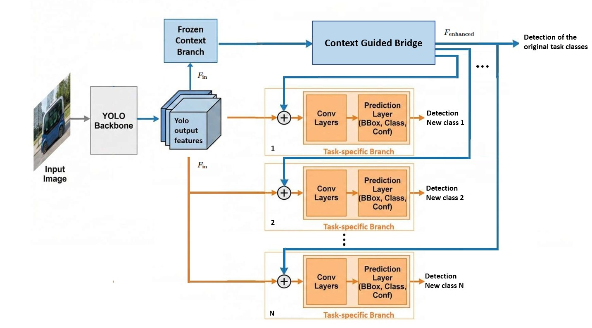
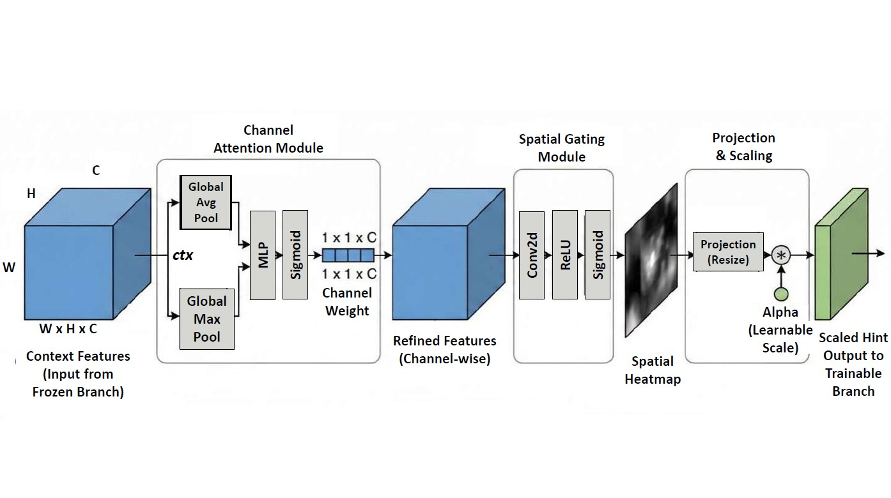
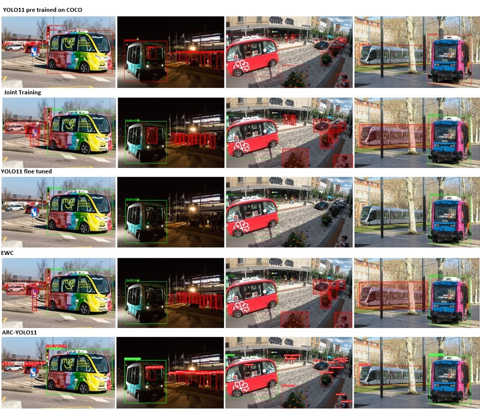

# Detection of Autonomous Shuttles in Urban Traffic Images Using Adaptive Residual Context
The progressive automation of transport promises to en-
hance safety and sustainability through shared mobility. Like other ve-
hicles and road users, and even more so for such a new technology, it
requires monitoring to understand how it interacts in traffic and to eval-
uate its safety. This can be done with fixed cameras and video object
detection. However, the addition of new detection targets generally re-
quires a fine-tuning approach for regular detection methods. Unfortu-
nately, this implementation strategy will lead to a phenomenon known as
catastrophic forgetting, which causes a degradation in scene understand-
ing. In road safety applications, preserving contextual scene knowledge
is of the utmost importance for protecting road users. We introduce the
Adaptive Residual Context (ARC) architecture to address this. ARC links
a frozen context branch and trainable task-specific branches through a
Context-Guided Bridge, utilizing attention to transfer spatial features
while preserving pre-trained representations. Experiments on a custom
dataset show that ARC matches fine-tuned baselines while significantly
improving knowledge retention, offering a data-efficient solution to add
new vehicle categories for complex urban environments.

## Key Contributions
1. We introduce a multiple head architecture that enables task-specific special-
ization while preserving pre-trained knowledge with a frozen generalist head
and trainable specialist heads;

2. We propose an adaptive residual attention mechanism that injects spatial
context into the specialist heads without complex temporal inputs;

4. We show that ARC matches the performance of fully fine-tuned models while
maintaining the integrity of original features.

## Dataset

The dataset is crafted for detecting autonomous shuttles Vehicles in urban environments, comprising:

- Images capturing diverse urban traffic scenarios.
- Annotations in YOLO formats.
- Pre-trained model checkpoints, allowing users to benchmark or further fine-tune.
This is not the full data set used in the training!
https://universe.roboflow.com/v1-eaxup/autonomous_shuttles-4/model/1

## Contact
For any questions or issues faced during the execution of code, feel free to reach out to me in: aziz11younes@gmail.com . 
